# Stellera Pay - Technical Architecture

*Last Updated: April 30, 2025*

## 1. System Overview

Stellera Pay is a comprehensive blockchain payment platform built on the Stellar network that integrates multiple payment solutions:

- Username-based payments
- Group expense tracking (Splitwise functionality)
- NFT ticketing
- Token swapping
- Rewards system

This document describes the technical architecture, components, and interactions that power the Stellera Pay platform.

## 2. Architecture Diagram

```mermaid
flowchart TB
    %% Main Components
    Client[Client Application] --> FrontendCore
    FrontendCore[Frontend Core] --> |API Calls| BackendAPI
    BackendAPI[Backend API] --> |Interacts with| StellarNetwork[Stellar Network]
    
    %% Wallet and Core Services
    FrontendCore --> WalletProvider[Wallet Provider]
    WalletProvider --> |Manages| Accounts[User Accounts]
    WalletProvider --> |Handles| Transactions[Transaction Signing]
    WalletProvider <--> |Connects to| StellarNetwork
    
    %% Core Features
    FrontendCore --> UsernamePay[Username Pay]
    FrontendCore --> Splitwise[Splitwise]
    FrontendCore --> NFTTicketing[NFT Ticketing]
    FrontendCore --> SwapFeature[Token Swap]
    FrontendCore --> RewardsSystem[Rewards System]

    %% Username Pay
    UsernamePay --> UsernameResolver[Username Resolver]
    UsernamePay --> PaymentProcessor[Payment Processor]
    UsernameResolver --> |Resolves| UserDatabase[(User Database)]
    PaymentProcessor --> |Creates| PaymentTransaction[Payment Transaction]
    PaymentTransaction --> WalletProvider
    
    %% Splitwise Feature
    Splitwise --> GroupExpenseTracker[Group Expense Tracker]
    Splitwise --> DebtCalculator[Debt Calculator]
    Splitwise --> ExpenseNotifications[Expense Notifications]
    GroupExpenseTracker --> |Creates| SplitTransaction[Split Transaction]
    SplitTransaction --> PaymentProcessor
    
    %% NFT Ticketing
    NFTTicketing --> EventCreator[Event Creator]
    NFTTicketing --> TicketIssuer[Ticket Issuer]
    NFTTicketing --> TicketTransfer[Ticket Transfer]
    NFTTicketing --> TicketValidator[Ticket Validator]
    TicketIssuer --> |Mints on| StellarNetwork
    TicketIssuer --> |Creates| TrustlineManager[Trustline Manager]
    TicketTransfer --> |Transfer via| StellarNetwork
    
    %% Token Swap
    SwapFeature --> AssetExchanger[Asset Exchanger]
    SwapFeature --> SmartContractSwap[Smart Contract Swap]
    SwapFeature --> SwapRateCalculator[Swap Rate Calculator]
    AssetExchanger --> |Creates| SwapTransaction[Swap Transaction]
    SmartContractSwap --> |Interacts with| SorobanContracts[Soroban Contracts]
    SorobanContracts --> StellarNetwork
    SwapTransaction --> WalletProvider
    
    %% Rewards System
    RewardsSystem --> PointsTracker[Points Tracker]
    RewardsSystem --> SLRTokenIssuer[SLR Token Issuer]
    RewardsSystem --> RewardPrograms[Reward Programs]
    SLRTokenIssuer --> TrustlineManager
    TrustlineManager --> |Creates| TrustlineTransaction[Trustline Transaction]
    TrustlineTransaction --> WalletProvider
    
    %% Backend Components
    BackendAPI --> UsernameAPI[Username API]
    BackendAPI --> TransactionAPI[Transaction API]
    BackendAPI --> TicketAPI[Ticket API]
    BackendAPI --> TrustlineAPI[Trustline API]
    BackendAPI --> NotificationAPI[Notification API]
    BackendAPI --> RewardsAPI[Rewards API]

    %% Data Storage
    MongoDB[(MongoDB)] --> UserDatabase
    MongoDB --> PaymentRecords[(Payment Records)]
    MongoDB --> NotificationData[(Notification Data)]
    MongoDB --> TicketRecords[(Ticket Records)]

    %% External Integration
    StellarNetwork --> |Testnet/Mainnet| HorizonAPI[Horizon API]
    StellarNetwork --> SorobanRPC[Soroban RPC]

    %% Styles
    classDef core fill:#f9f,stroke:#333,stroke-width:2px
    classDef feature fill:#bbf,stroke:#333,stroke-width:1px
    classDef api fill:#bfb,stroke:#333,stroke-width:1px
    classDef storage fill:#fbb,stroke:#333,stroke-width:1px
    classDef external fill:#ddd,stroke:#333,stroke-width:1px
    
    class FrontendCore,WalletProvider,BackendAPI core
    class UsernamePay,Splitwise,NFTTicketing,SwapFeature,RewardsSystem feature
    class UsernameAPI,TransactionAPI,TicketAPI,TrustlineAPI,NotificationAPI,RewardsAPI api
    class MongoDB,UserDatabase,PaymentRecords,NotificationData,TicketRecords storage
    class StellarNetwork,HorizonAPI,SorobanRPC external
```



## 3. Technology Stack

### 3.1. Frontend
- **Framework**: Next.js (App Router)
- **Language**: TypeScript
- **UI Library**: React
- **Styling**: TailwindCSS with shadcn/ui components
- **State Management**: React Context API + React Hooks
- **Client-side Validation**: Zod
- **Animations**: CSS transitions, custom particle system

### 3.2. Backend
- **API Framework**: Next.js API Routes
- **Database**: MongoDB (via MongoDB Atlas)
- **Authentication**: Self-custodial wallet-based authentication
- **Data Validation**: Zod schemas

### 3.3. Blockchain
- **Network**: Stellar
- **Transaction SDK**: Stellar SDK
- **Smart Contracts**: Soroban
- **Wallet SDK**: Stellar Wallet SDK
- **Asset Management**: Custom trustline manager

### 3.4. DevOps
- **Version Control**: Git
- **Package Manager**: pnpm
- **Deployment**: Vercel
- **Environment Management**: dotenv for environment variables
- **Analytics**: Custom analytics for user behavior tracking

## 4. Core Components

### 4.1. Wallet Provider

The wallet provider is the cornerstone of the Stellera Pay system, responsible for:

- Wallet creation and management
- Account switching
- Transaction signing
- Balance checking
- Network interaction (via Stellar SDK)

**Implementation**: `/app/providers/wallet-provider.tsx`

The wallet provider uses the Stellar Wallet SDK to manage wallets and interact with the Stellar network. It provides a React context that makes wallet functionality available throughout the application.

```typescript
// Core wallet functionality
const WalletProvider = ({ children }) => {
  // State management for wallet connection
  const [wallet, setWallet] = useState(null);
  const [isConnected, setIsConnected] = useState(false);
  const [publicKey, setPublicKey] = useState("");
  const [accounts, setAccounts] = useState([]);
  
  // Functions for wallet operations (connect, disconnect, sign, etc.)
  
  return (
    <WalletContext.Provider value={{
      wallet, isConnected, publicKey, accounts,
      connect, disconnect, sign, getBalance, createAccount, ...
    }}>
      {children}
    </WalletContext.Provider>
  );
};
```

### 4.2. Username Resolution System

The username resolution system maps human-readable usernames to Stellar addresses.

**Implementation**: 
- Frontend: `/app/components/recipient-input.tsx`, `/app/hooks/use-username.ts`
- Backend: `/app/api/username/route.ts`, `/app/api/username/search/route.ts`
- Database: `/app/models/username.ts`

Usernames are stored in MongoDB with their corresponding Stellar wallet addresses. The system provides real-time searching and validation.

### 4.3. Payment Processor

The payment processor handles creating, signing, and submitting payment transactions to the Stellar network.

**Implementation**: `/lib/stellar-transactions.ts`

Key functionality:
- Transaction creation for different operation types
- Fee calculation
- Transaction submission and status tracking
- Error handling for failed transactions

### 4.4. Trustline Manager

The trustline manager handles creation of trustlines for custom assets on Stellar.

**Implementation**: 
- Frontend: `/app/components/manage-trustline.tsx`
- Backend: `/app/api/trustlines/create/route.ts`
- Blockchain: `/lib/stellar-transactions.ts` (createChangeTrustTransaction function)

### 4.5. Notification System

The notification system tracks user activities and provides real-time alerts.

**Implementation**:
- Frontend: `/app/components/notification/notification-dropdown.tsx`
- Backend: `/app/api/notifications/route.ts`, `/app/api/notifications/[id]/route.ts`

## 5. Feature Modules

### 5.1. Username Pay

**Key Files**:
- `/app/username-pay/page.tsx`: Main UI for username payments
- `/app/components/recipient-input.tsx`: Component for recipient selection
- `/lib/stellar-transactions.ts`: Transaction creation and submission

**Data Flow**:
1. User enters recipient username
2. System resolves username to Stellar address
3. User enters amount and asset details
4. Frontend creates payment transaction
5. Wallet provider signs transaction
6. Transaction is submitted to Stellar network
7. Transaction record is stored and notification is created

### 5.2. Splitwise Integration

**Key Files**:
- `/app/splitwise/page.tsx`: Main UI for expense tracking
- `/app/splitwise/components/`: UI components for expense management
- `/app/api/notifications/dues/route.ts`: Manages due payments

**Data Flow**:
1. Users create or join groups
2. Expenses are recorded with multiple participants
3. System calculates optimal debt settlement path
4. Users can settle debts through direct payments
5. Notifications keep all participants updated

### 5.3. NFT Ticketing

**Key Files**:
- `/app/nft-tickets/page.tsx`: Main UI for NFT tickets
- `/app/api/tickets/create/route.ts`: API endpoint for ticket creation
- `/app/api/tickets/send/route.ts`: API endpoint for ticket transfer

**Data Flow**:
1. Event creator creates an event and defines ticket tiers
2. System mints tickets as NFTs on Stellar
3. Recipients create trustlines to receive ticket assets
4. Tickets can be transferred between users
5. Validation occurs via QR code scanning

### 5.4. Token Swap

**Key Files**:
- `/app/swap/page.tsx`: UI for token swapping
- `/contracts/soroban-hello-world/`: Soroban smart contract for atomic swaps
- `/packages/hello_world/`: JavaScript wrapper for the smart contract

**Data Flow**:
1. User selects source asset, destination asset and amount
2. System calculates exchange rate and estimated output
3. If using Soroban contracts, atomic swap is executed
4. Otherwise, direct payment is used
5. Transaction record is stored and notification is created

### 5.5. Rewards System

**Key Files**:
- `/app/rewards/page.tsx`: Main UI for rewards management
- `/app/api/rewards/route.ts`: API endpoint for rewards processing
- `/app/components/reward-transactions.tsx`: Display for reward transactions
- `/app/hooks/use-rewards.ts`: Hook for rewards functionality

**Data Flow**:
1. User transactions are tracked for reward eligibility
2. System calculates SLR tokens based on XLM spent (1 SLR per 100 XLM)
3. Upon reaching thresholds, SLR tokens are issued
4. Users can redeem rewards for benefits
5. Reward history is displayed in the UI

## 6. Database Schema

### 6.1. User Model
```typescript
interface User {
  _id: ObjectId;
  walletAddress: string;
  createdAt: Date;
  updatedAt: Date;
  email?: string;
  displayName?: string;
  avatarUrl?: string;
  preferences?: {
    theme: 'light' | 'dark' | 'system';
    notifications: boolean;
  };
}
```

### 6.2. Username Model
```typescript
interface UsernameRecord {
  _id: ObjectId;
  username: string;
  walletAddress: string;
  createdAt: Date;
  updatedAt: Date;
  verified: boolean;
  owner: ObjectId; // Reference to User
}
```

### 6.3. Transaction Record Model
```typescript
interface TransactionRecord {
  _id: ObjectId;
  txHash: string;
  sender: string;
  recipient: string;
  amount: number;
  asset: string;
  memo?: string;
  createdAt: Date;
  status: 'pending' | 'completed' | 'failed';
  type: 'payment' | 'swap' | 'ticket' | 'trustline';
}
```

### 6.4. Notification Model
```typescript
interface Notification {
  _id: ObjectId;
  recipient: string;
  type: 'payment_sent' | 'payment_received' | 'expense_added' | 'expense_settled' | 'reward_earned';
  title: string;
  description: string;
  read: boolean;
  createdAt: Date;
  data?: Record<string, any>;
}
```

## 7. API Endpoints

### 7.1. User Management
- `GET /api/user` - Get current user profile
- `PUT /api/user` - Update user profile
- `GET /api/users/search?q=query` - Search for users

### 7.2. Username Management
- `POST /api/username` - Register a username
- `GET /api/username?username=name` - Resolve username to address
- `GET /api/username/search?q=query` - Search for usernames

### 7.3. Payments & Transactions
- `POST /api/transactions/submit` - Submit transaction to the network

### 7.4. Notifications
- `GET /api/notifications` - Get user notifications
- `POST /api/notifications` - Create a new notification
- `PATCH /api/notifications/:id` - Mark notification as read
- `GET /api/notifications/dues` - Get pending dues for Splitwise

### 7.5. Rewards
- `POST /api/rewards` - Track transaction for rewards
- `POST /api/rewards/initialize` - Initialize rewards for a user

### 7.6. Trustlines
- `POST /api/trustlines/create` - Create a trustline

### 7.7. NFT Tickets
- `POST /api/tickets/create` - Create NFT tickets
- `POST /api/tickets/send` - Send tickets to a recipient

## 8. Smart Contract Architecture

### 8.1. Token Swap Contract

**Implementation**: `/contracts/soroban-hello-world/`

The swap contract enables atomic exchanges between different assets on the Stellar network. It uses Soroban, Stellar's smart contract platform, to ensure that swaps either complete fully or revert entirely.

Key functionality:
- Atomic asset exchange
- Slippage protection
- Deadline enforcement

```rust
pub fn swap(
    a: Address,
    b: Address,
    token_a: Address,
    token_b: Address,
    amount_a: i128,
    min_b_for_a: i128,
    amount_b: i128,
    min_a_for_b: i128,
) -> Result<bool, Error> {
    // Implementation of atomic swap logic
}
```

The JavaScript wrapper in `/packages/hello_world/` provides a client-side interface to interact with the smart contract.

## 9. Security Considerations

### 9.1. Wallet Security
- Self-custodial approach where users maintain control of private keys
- Optional PIN code protection for transaction signing
- No storage of private keys on the server

### 9.2. Transaction Security
- Client-side transaction creation and signing
- Server-side validation of transaction parameters
- Rate limiting on API endpoints
- Transaction hash verification

### 9.3. User Data Protection
- Minimal collection of personal information
- End-to-end encryption for sensitive data
- Authentication via wallet signatures

### 9.4. Smart Contract Security
- Rigorous testing of smart contracts
- Audited code base
- Limited scope for smart contract operations
- Fail-safe mechanisms

## 10. Performance Considerations

### 10.1. Frontend Optimization
- Next.js for server-side rendering and static generation
- Code splitting and lazy loading
- Optimized asset delivery
- Memoization for expensive calculations

### 10.2. Backend Efficiency
- Connection pooling for database access
- Caching of frequently accessed data
- Efficient pagination for large result sets
- Background processing for non-critical tasks

### 10.3. Blockchain Interactions
- Batching of blockchain operations where possible
- Caching of blockchain data
- Optimistic UI updates before blockchain confirmation
- Proper error handling and retry mechanisms

## 11. Scalability Strategy

### 11.1. Horizontal Scaling
- Stateless API design for horizontal scaling
- Distributed database with sharding capabilities
- Load balancing across multiple instances

### 11.2. Caching Strategy
- Multi-layered caching (client, CDN, server)
- Redis for high-speed data caching
- Cache invalidation strategies for different data types

### 11.3. Database Scaling
- MongoDB Atlas for managed scaling
- Proper indexing strategy
- Data partitioning based on usage patterns

## 12. Development Workflow

### 12.1. Environment Setup
- Development environment with Stellar testnet
- Staging environment with production-like data
- Production environment with Stellar mainnet

### 12.2. Testing Strategy
- Unit tests for individual components
- Integration tests for API endpoints
- End-to-end tests for critical user flows
- Smart contract testing with specialized tools

### 12.3. Deployment Process
- CI/CD pipeline with automated testing
- Staged rollouts to catch issues early
- Feature flags for controlled feature releases
- Easy rollback mechanisms

## 13. Future Architectural Considerations

### 13.1. Mobile Applications
- React Native mobile app sharing core logic
- Native wallet integration on mobile platforms
- Offline capabilities for core functions

### 13.2. Advanced Smart Contracts
- Expanding Soroban contract capabilities
- Multi-party escrow and time-locked transactions
- Complex financial instruments

### 13.3. Interoperability
- Cross-chain functionality with other blockchains
- Integration with DeFi protocols
- Fiat on/off ramps

## 14. Conclusion

The Stellera Pay architecture provides a robust foundation for a comprehensive blockchain payment platform. By leveraging the speed and low cost of the Stellar network, combined with modern web technologies and user-friendly interfaces, the system delivers a seamless experience for digital payments, group expense management, NFT ticketing, and token swapping.

The modular design allows for independent scaling and development of different features while maintaining a cohesive user experience. The focus on self-custodial wallet management ensures that users maintain control of their assets while benefiting from the convenience of the platform.