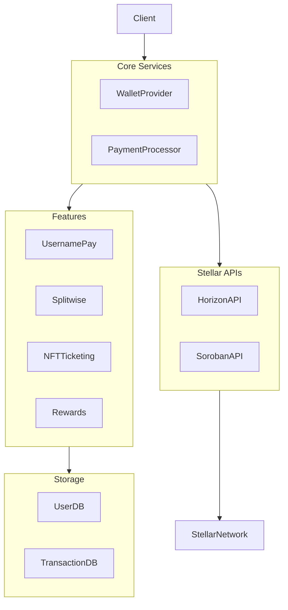

# Stellera Pay

## The Future of Digital Payments

---

## The Problem

- Traditional payment systems are slow and expensive
- Cross-border transactions face high fees and delays
- Username-based payments lack mainstream adoption
- Group expenses are difficult to track and settle
- Digital event ticketing vulnerable to fraud

---

## Our Solution

 <!-- element class="r-stretch" -->

Stellera Pay: A comprehensive blockchain payment platform built on Stellar

---

<!-- .slide: data-auto-animate -->

## Core Features

---

<!-- .slide: data-auto-animate -->

## Core Features

<grid drag="100 80" drop="center" flow="col" align="stretch">

### Username Pay

Send payments to memorable usernames instead of complex addresses

### Splitwise Integration

Split bills and track shared expenses effortlessly

### NFT Ticketing

Create, distribute and verify event tickets as NFTs

### Rewards System

Earn SLR tokens for platform activity

</grid>

---

## Username Pay

<split even>

 <!-- element height="300" -->

<grid drag="45 80" drop="right" flow="col" align="left">
- Send payments using @usernames
- Resolve usernames to Stellar addresses
- Transaction history and notifications
- Easy contact management
+ Eliminates complex addresses
+ Improved user experience
</grid>

</split>

---

## Splitwise Integration

<split even>

<grid drag="45 80" drop="left" flow="col" align="left">
- Group expense tracking
- Automated debt calculation
- Settle debts with one click
- Real-time notifications
+ Optimizes payment paths
+ Leverages blockchain for transparency
</grid>

 <!-- element height="300" -->

</split>

---

## NFT Ticketing

<split even>

 <!-- element height="300" -->

<grid drag="45 80" drop="right" flow="col" align="left">
- Create event tickets as NFTs
- Secure distribution on Stellar
- QR code verification
- Transferable ownership
+ Prevents counterfeiting
+ Enables secondary markets
</grid>

</split>

---

## Rewards System

<split even>

<grid drag="45 80" drop="left" flow="col" align="left">
- Earn SLR tokens through platform usage
- 1 SLR per 100 XLM spent
- Redeem for benefits and discounts
- Multiple reward programs
+ Increases user retention
+ Creates platform ecosystem
</grid>

 <!-- element height="300" -->

</split>

---

<!-- .slide: data-auto-animate -->

## Technical Architecture

---

<!-- .slide: data-auto-animate -->

## Technical Architecture

---

## Competitive Advantages

<grid drag="100 80" drop="center" flow="row" align="stretch">
Comprehensive platform integrating multiple payment solutions
Username-based payments for improved user experience
Blockchain transparency for group finances
NFT ticketing preventing fraud and enabling secondary markets
Built on Stellar for fast, low-cost transactions
Rewards ecosystem increasing user loyalty and engagement
</grid>

---

## Target Audience

<split even gap="2">
### Primary
- Young professionals (25-40)
- Tech-savvy consumers
- Cryptocurrency enthusiasts
- Event organizers

### Secondary

- Small businesses
- Online merchants
- Content creators
- Educational institutions
  </split>

---

## Business Model

<grid drag="100 80" drop="center" flow="col" align="stretch">
**Transaction Fees**
Small percentage on transactions and currency conversions

**Premium Features**
Advanced analytics, custom usernames, business accounts

**NFT Ticket Commission**
Fee on ticket issuance and secondary sales

**SLR Token Economy**
Token utility driving platform ecosystem value
</grid>

---

---

## Why Now?

<grid drag="100 80" drop="center" flow="col" align="stretch">
- Increasing adoption of blockchain technology
- Growing dissatisfaction with traditional payment systems
- Rising popularity of username-based online identities
- Maturity of the Stellar network for real-world applications
- Shift toward digital-first financial experiences
</grid>

---

<!-- .slide: bg="black" -->

## Thank You

  

    Join the financial revolution with Stellera Pay
  

